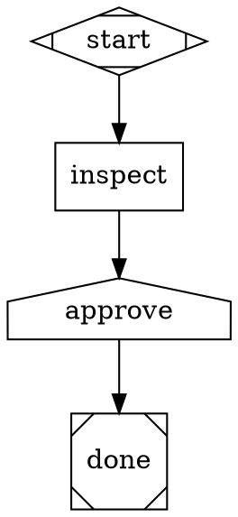
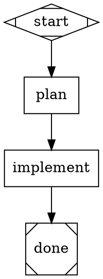
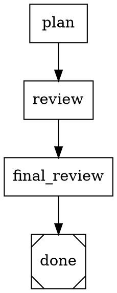
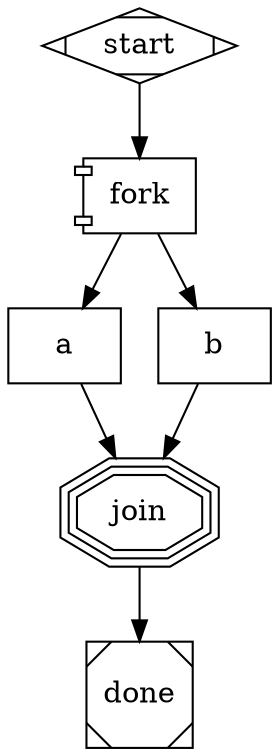

# Attractor

Attractor is a Python platform for running multi-stage AI agent workflows.

It combines:

- A DOT workflow engine for graph-shaped agent pipelines.
- A durable operations platform with git worktree isolation, run history, checkpoints, human approval gates, and branch write-back.
- A React operations console for registering repositories, launching workflows, watching live runs, approving gates, testing model configuration, and reviewing run output.

The platform is the primary way to use Attractor. The lower-level DOT engine and legacy local runner are still available for standalone `.dot` files.

## Prerequisites

- Python 3.12+
- [uv](https://docs.astral.sh/uv/)
- Node.js and npm, for building or developing the operations console
- Provider API key(s) only when you want real agent model calls:
  - `ANTHROPIC_API_KEY`
  - `OPENAI_API_KEY`
  - `GOOGLE_API_KEY` or `GEMINI_API_KEY`

SQLite is the default platform database. There is no database service to install for local use.

## Quickstart

Clone the repository and install Python dependencies:

```bash
uv sync
```

Build the console:

```bash
(cd web && npm install && npm run build)
```

Start the platform server:

```bash
uv run python -m attractor_server --platform --port 8000
```

Open <http://127.0.0.1:8000>.

In platform mode, the server serves both the API and the built console. The console build is resolved in this order:

1. `--spa-dist`
2. `ATTRACTOR_SPA_DIST`
3. bundled `attractor_server/web/dist`
4. local `web/dist`

For example:

```bash
uv run python -m attractor_server --platform --port 8000 --spa-dist web/dist
```

## Dev Mode

Run the backend and frontend as two processes when you want Vite hot reload:

```bash
uv run python -m attractor_server --platform --port 8000
```

```bash
(cd web && npm run dev)
```

The Vite server listens on <http://127.0.0.1:5173> and proxies `/api` to `http://127.0.0.1:8000` by default. Override the proxy target with `VITE_PLATFORM_API_TARGET`.

## Configuration

Local platform defaults:

- database: `.attractor-platform.sqlite3`
- managed worktrees: `.attractor-worktrees`
- artifacts: `.attractor-artifacts`
- settings secret key: `~/.attractor/platform-secret.key`

Useful server options:

```bash
uv run python -m attractor_server \
  --platform \
  --host 127.0.0.1 \
  --port 8000 \
  --database-url sqlite+aiosqlite:///./.attractor-platform.sqlite3 \
  --worktree-root .attractor-worktrees \
  --artifact-root .attractor-artifacts
```

Environment variables:

- `ATTRACTOR_DATABASE_URL`: optional database URL. SQLite is the default; Postgres is optional.
- `ATTRACTOR_SPA_DIST`: path to a built console directory containing `index.html`.
- `ATTRACTOR_PLATFORM_URL`: default platform URL for `attractor run`.
- `ATTRACTOR_DEFAULT_PROVIDER` and `ATTRACTOR_DEFAULT_MODEL`: runtime defaults for new model-backed runs.
- `ATTRACTOR_WORKTREE_ROOT` and `ATTRACTOR_ARTIFACT_ROOT`: default roots for managed worktrees and artifacts.
- `ATTRACTOR_SECRET_KEY_PATH`: optional path for the encrypted settings vault key.

Provider keys can be supplied through environment variables or through **Settings -> Secrets** in the console. Console-entered provider secrets are stored in the encrypted, write-only settings vault and are not returned by the settings API. **Settings -> Models** shows catalog readiness and runs model tests against configured credentials.

Recommended example model IDs from the shipped catalog:

- Anthropic: `claude-opus-4-8`, `claude-sonnet-5`, `claude-haiku-4-5-20251001` with alias `claude-haiku-4-5`
- OpenAI: `gpt-5.5`, `gpt-5.4-mini`
- Google: `gemini-3.5-flash`

Defaults are `claude-sonnet-5`, `gpt-5.5`, and `gemini-3.5-flash` for Anthropic, OpenAI, and Gemini respectively.

## Author A Workflow

Platform workflows live inside the repository they operate on:

```text
<repo>/
  .attractor/
    project.toml
    workflows/
      release-checks/
        workflow.dot
        workflow.toml
```

Only `workflow.dot` is required. `.attractor/project.toml` and each `workflow.toml` are optional.

Create a workflow package:

```bash
mkdir -p .attractor/workflows/release-checks
$EDITOR .attractor/workflows/release-checks/workflow.dot
```

Example `workflow.dot`:



Example `.attractor/project.toml`:

```toml
default_environment = "local"
allowed_execution_modes = ["local"]

[variables]
release_channel = "internal"
```

Example `workflow.toml`:

```toml
display_name = "Release Checks"
description = "Inspect release readiness and pause for operator approval."
tags = ["release", "quality"]

[inputs]
target = "wheel"
```

Workflow names are names, not paths. Absolute paths, `..`, `/`, and `\` are rejected.

Platform runs use git worktrees, so the registered repository must be a clean, committed git repository. Commit the workflow files before launching:

```bash
git status --short
git add .attractor
git commit -m "add attractor workflow"
```

## Launch A Run

### From The Console

1. Start the platform server.
2. Open the console.
3. Go to **Repos** and register the local repository path.
4. Open the repo, choose a discovered workflow, validate it, and launch a run.
5. Watch the run from **Runs** or the run detail page.

The run detail page shows graph state, live timeline events, approvals, artifacts, checkpoints, diffs, and write-back actions when available.
For first-time registration, the folder browser can start from server-side browse roots before any repo is registered.
Set `ATTRACTOR_BROWSE_ROOTS` to add allowed registration roots; hidden directories and symlink escapes stay blocked.

### From The CLI

Launch a durable platform run:

```bash
uv run attractor run release-checks \
  --repo /path/to/repo \
  --server-url http://127.0.0.1:8000 \
  --input target=wheel
```

Or set the server URL once:

```bash
export ATTRACTOR_PLATFORM_URL=http://127.0.0.1:8000
uv run attractor run release-checks --repo /path/to/repo --input target=wheel
```

`--input` accepts `key=value` and can be provided more than once. The CLI posts the launch request to `/api/runs` and prints the run id, initial status, and API URL.

To run a bare DOT file with the old in-process engine instead of the platform:

```bash
uv run attractor run --legacy-local examples/fibonacci.dot --provider anthropic --model claude-sonnet-5 --no-tools
```

To validate a bare DOT file without running it:

```bash
uv run attractor validate examples/fibonacci.dot
```

## Shipped Platform Features

- Durable run history, run records, artifacts, approvals, checkpoints, and events stored in the platform database.
- Server-managed git worktree isolation on branches named `attractor/runs/<run_id>`.
- Per-stage git checkpoints recorded under `refs/attractor/runs/<run_id>/checkpoints/...`.
- Human approval gates for `house` nodes, with console/API decision flow and run resume.
- Branch-from-worktree write-back for completed runs, with branch validation and protected-branch safeguards.
- Model catalog, provider credential status, and **Test models** action in Settings.
- Operations console with repo registration, workflow validation, run board, run detail graph, timeline, approvals, settings, system health, and live event streaming.

## DOT Engine Reference

A workflow is a Graphviz DOT graph. Nodes are stages; edges define order and conditional flow.

Common node shapes:

| Shape | Node type | Purpose |
| --- | --- | --- |
| `Mdiamond` | Start | Entry point |
| `box` | Codergen | Calls an LLM or agent backend |
| `diamond` | Conditional | Chooses an outgoing edge by condition |
| `house` | Human gate | Waits for an operator answer |
| `hexagon` | Manager | Runs a child graph with retry/supervision |
| `parallelogram` | Tool | Runs a shell command |
| `component` | Parallel | Fans out concurrent branches |
| `tripleoctagon` | Fan-in | Joins parallel branches |
| `Msquare` | Exit | Terminal stage |

Prompts support `$variable` and `${variable}` expansion from graph context:



Model stylesheets assign providers and models to nodes with CSS-like selectors:



Specificity is `*` < shape selector < `.class` < `#id`. Explicit node attributes override stylesheet values.

Parallel fan-out and fan-in:



## Legacy HTTP API

Starting the server without `--platform` runs the legacy in-memory pipeline API:

```bash
uv run python -m attractor_server --port 8080
```

That mode exposes `/pipelines` endpoints for direct DOT submission and SSE event streaming. It is useful for lower-level engine testing, but it does not provide durable platform storage, repo registration, worktree isolation, the operations console, or branch write-back.

## Development

Install dev dependencies:

```bash
uv sync --extra dev
```

Run Python tests:

```bash
uv run python -m pytest tests/ -q
```

Run lint:

```bash
uv run ruff check src tests
```

Run web tests:

```bash
(cd web && npm run test:graph)
```

Build the wheel:

```bash
uv build
```

## Roadmap / Not Yet

Attractor currently ships as clone, build, and run from source. There is no packaged binary, PyPI release, or Docker image yet.

Factory features such as PR automation, steering, MCP integration, hooks, and scheduled automations are future work. Control-plane and distribution features such as cloud sandboxes, SSH/preview access, SSO, and hosted multi-tenant deployment are also not part of the current local platform.

## Credits

Attractor implements the public [StrongDM Attractor](https://github.com/strongdm/attractor) natural-language specifications. This repository was forked from [samueljklee/attractor](https://github.com/samueljklee/attractor), whose implementation work provides the foundation for the DOT engine, agent loop, provider integrations, and local platform that this fork continues to develop.

## License

This implementation is provided as-is. The original Attractor specifications are licensed under [Apache License 2.0](https://github.com/strongdm/attractor/blob/main/LICENSE) by StrongDM.
